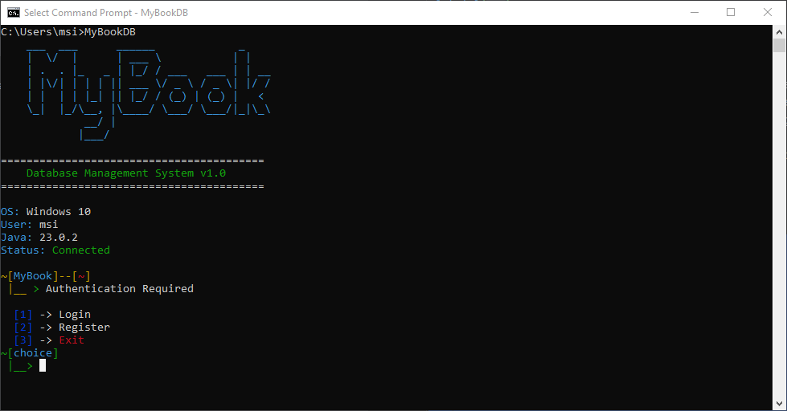
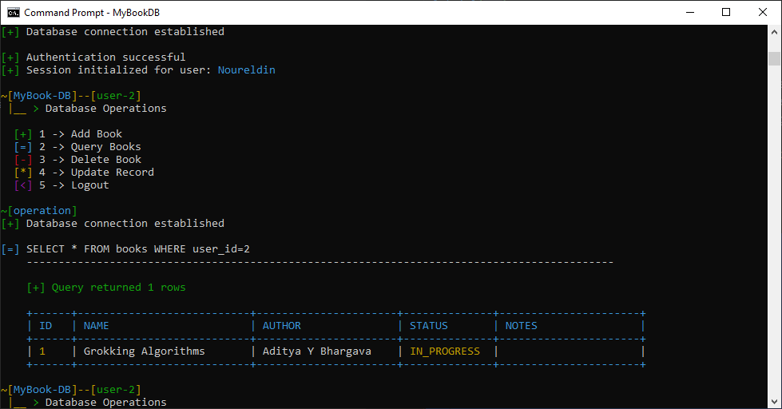

# MyBook Database Management System

A stylish command-line interface (CLI) application for managing your personal book library with MySQL database integration.


## Features

- 🔐 **User Authentication** - Secure login and registration with hidden password input
- 📚 **Book Management** - Add, view, update, and delete books
- 📊 **Reading Status** - Track books as NotRead, InProgress, or Done
- 🎨 **Stylish CLI** - Terminal-inspired interface with color-coded operations
- 🔒 **User Isolation** - Each user has their own private book collection
- 💾 **MySQL Backend** - Reliable database storage with relationship integrity

## Screenshots





## Prerequisites

- **Java** 23.0.2 or higher
- **MySQL** 8.0 or higher
- **MySQL Connector/J** 8.4.0

## Installation

### 1. Clone or Download the Project

```bash
git clone https://github.com/nourreeldin/MyBookDB.git
cd MyBookDB
```

### 2. Download MySQL Connector

Download `mysql-connector-j-8.4.0.jar` from:
- https://dev.mysql.com/downloads/connector/j/

Place it in your project's `lib` folder or root directory.

### 3. Set Up MySQL Database

Open MySQL Workbench or MySQL command line and execute:

```sql
CREATE DATABASE mybookdb;

USE mybookdb;

CREATE TABLE users (
    id INT AUTO_INCREMENT PRIMARY KEY,
    username VARCHAR(50) NOT NULL UNIQUE,
    password_hash VARCHAR(256) NOT NULL
);

CREATE TABLE books (
    id INT AUTO_INCREMENT PRIMARY KEY,
    user_id INT NOT NULL,
    name VARCHAR(255) NOT NULL,
    author VARCHAR(255),
    edition INT,
    notes TEXT,
    status ENUM('NotRead', 'InProgress', 'Done') DEFAULT 'NotRead',
    created_at TIMESTAMP DEFAULT CURRENT_TIMESTAMP,
    FOREIGN KEY (user_id) REFERENCES users(id) ON DELETE CASCADE
);
```

### 4. Configure Database Connection

Edit `DBConnection.java` and update your MySQL credentials:

```java
private static final String URL = "jdbc:mysql://localhost:3306/mybookdb";
private static final String USER = "root";
private static final String PASSWORD = "your_mysql_password";
```

or use `.env` file for better security

## Running the Tool

### Option 1: Using IntelliJ IDEA

1. Open the project in IntelliJ IDEA
2. Add `mysql-connector-j-8.4.0.jar` to project libraries:
   - **File** → **Project Structure** → **Libraries** → **+** → Select JAR
3. Enable terminal emulation:
   - **Run** → **Edit Configurations** → Check **"Emulate terminal in output console"**
4. Run `CLI.java`

### Option 2: Using Command Line (Windows)

```cmd
cd src
javac -cp ".;mysql-connector-j-8.4.0.jar" *.java
java -cp ".;mysql-connector-j-8.4.0.jar" CLI
```

### Option 3: Using Command Line (Linux/Mac)

```bash
cd src
javac -cp ".:mysql-connector-j-8.4.0.jar" *.java
java -cp ".:mysql-connector-j-8.4.0.jar" CLI
```

## Usage Guide

### First Time Setup

1. **Register a new account**
   ```
   ~[MyBook]--[~]
    |__ > Authentication Required
   
     [1] -> Login
     [2] -> Register
     [3] -> Exit
   ~[choice]
    |__> 2
   ```

2. **Enter credentials**
   - Username will be visible
   - Password will be hidden (shown as `*`)

3. **Login after registration**
   - Select option `[1]` and enter your credentials

### Managing Books

#### Add a Book
```
[+] 1 -> Add Book
```
Enter book details:
- Book name
- Author
- Edition (number)
- Notes

#### View All Books
```
[=] 2 -> Query Books
```
Displays a formatted table with all your books.

#### Delete a Book
```
[-] 3 -> Delete Book
```
Shows your books, then enter the ID to delete.

#### Update Book Status
```
[*] 4 -> Update Record
```
Select a book ID and update:
- Status (NotRead / InProgress / Done)
- Notes

#### Logout
```
[<] 5 -> Logout
```

## Project Structure

```
MyBookDB/
├── src/
│   ├── CLI.java              # Main CLI interface
│   ├── DBConnection.java     # Database connection handler
│   ├── Scripts.java          # Database operations (CRUD)
│   ├── User.java             # User model
│   ├── Book.java             # Book model
│   └── Status.java           # Status enum (NotRead/InProgress/Done)
└── README.md
```

## Database Schema

### Users Table
| Column        | Type         | Description              |
|---------------|--------------|--------------------------|
| id            | INT          | Primary key (auto)       |
| username      | VARCHAR(50)  | Unique username          |
| password_hash | VARCHAR(256) | Hashed password          |

### Books Table
| Column     | Type         | Description                    |
|------------|--------------|--------------------------------|
| id         | INT          | Primary key (auto)             |
| user_id    | INT          | Foreign key to users           |
| name       | VARCHAR(255) | Book title                     |
| author     | VARCHAR(255) | Author name                    |
| edition    | INT          | Edition number                 |
| notes      | TEXT         | User notes                     |
| status     | ENUM         | NotRead/InProgress/Done        |
| created_at | TIMESTAMP    | Auto-generated timestamp       |

## Color Coding

The CLI uses color-coded operations for better UX:

- 🟢 **Green** - Add operations, success messages
- 🔵 **Cyan** - Query/view operations
- 🔴 **Red** - Delete operations, errors
- 🟡 **Yellow** - Update operations, warnings
- 🟣 **Purple** - Logout/exit operations


## Security Notes

⚠️ **Important**: This is a learning project. For production use:

- Use proper password hashing (BCrypt, Argon2)
- Store database credentials securely (environment variables, config files)
- Implement SQL injection prevention (PreparedStatements are used ✓)
- Add input validation and sanitization
- Use HTTPS for network transmission

## Contributing

Contributions are welcome! Please feel free to submit a Pull Request.

## Author

Created with ❤️ for book lovers who appreciate a good terminal interface


---

**Happy Reading! 📚**
